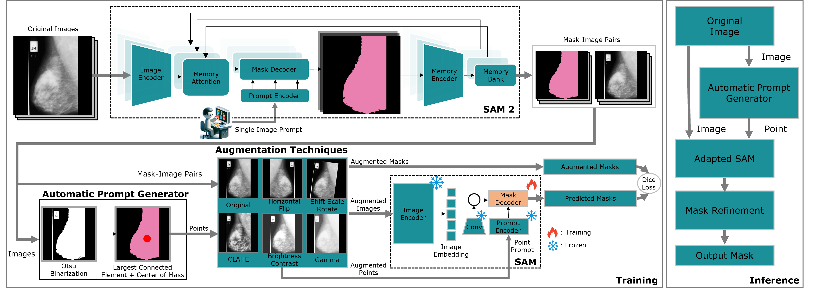
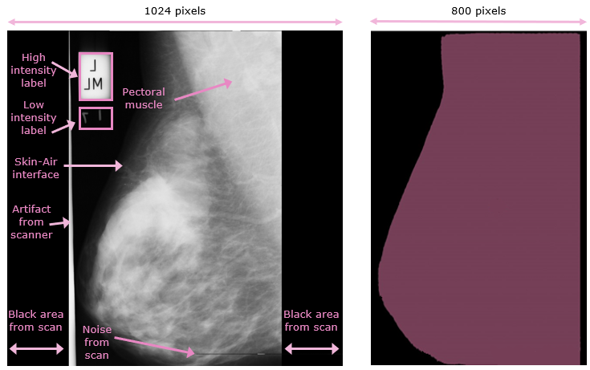
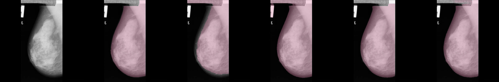
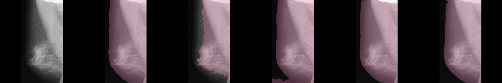
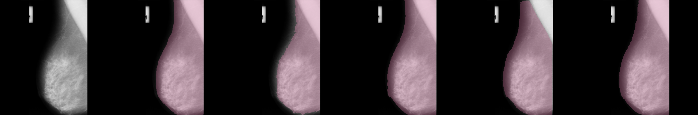

# SAM 2-Driven Self-Training for Mammogram Segmentation: Zero-Shot Mask Generation via Pseudo-Video

**Mauricio Fernandez M.<sup>1</sup> ([mfernandez@csu.edu.cn](mailto:mfernandez@csu.edu.cn)), Yixiong Liang<sup>1*</sup> ([yxliang@csu.edu.cn](https://scholar.google.com/citations?user=-7M32PIAAAAJ&hl=en)), Christopher A. Cochran<sup>2</sup>**

*<sup>1</sup>School of Computer Science, Central South University, Changsha 410083, P.R. China* <br>
*<sup>2</sup>School of Automation, Central South University, Changsha 410083, P.R. China* <br>

<p align="center">
  <a href="https://ieeexplore.ieee.org/document/11084376" class="button"><b>Read the Paper (IEEE Xplore)</b></a> &nbsp;&nbsp;
  <a href="#code" class="button"><b>View the Code (Kaggle)</b></a> &nbsp;&nbsp;
  <a href="#citation" class="button"><b>Cite this Work</b></a>
</p>

### Methodology Overview
<p align="center">
  
</p>
<p align="center">
  <em>Overview of the SAM 2-driven self-training methodology for mammogram segmentation.</em>
</p>

---

## Abstract
Accurate mammogram segmentation is crucial for breast cancer diagnosis. However, existing Deep Learning methods often require large, annotated datasets, which are time-consuming and expensive to obtain. 

We introduce SAM 2-driven self-training, a novel approach that leverages SAM 2 for efficient and accurate mammogram segmentation. By constructing a pseudo-video sequence from static mammograms, we use SAM 2 video inference to generate initial masks, subsequently applying them for parameter-efficient adaptation of SAM, focusing on the mask decoder, and an automatic point prompt generator for enhanced usability. 

Our method significantly reduces the need for manual annotation while maintaining high accuracy. Evaluations on the mini-MIAS and CBIS-DDSM datasets demonstrate significant improvements in accuracy and efficiency compared to established techniques and the original SAM. This robust solution facilitates rapid mammogram segmentation and aids creating annotated datasets with minimal user intervention.

---

## Code
The implementation of our work is available in a series of Kaggle notebooks, covering the entire pipeline from data preparation to model training.

*   **[1. Data Preparation](https://www.kaggle.com/code/mauriciofernandezm/data-prep):** This notebook covers the initial steps of processing the mammogram datasets, including artifact removal and normalization.
*   **[2. Pseudo-Mask Generation](https://www.kaggle.com/code/mauriciofernandezm/pseudo-masks):** This notebook demonstrates how to create a pseudo-video and use SAM 2 to generate the initial zero-shot segmentation masks.
*   **[3. Self-Training and Augmentation](https://www.kaggle.com/code/mauriciofernandezm/aug-train):** This notebook details the self-training process, where the pseudo-masks are used to fine-tune the SAM decoder.

---

## Key Contributions
1.  **Self-Training for Zero-Shot Mammogram Segmentation:** Developed a novel and efficient self-training methodology that leverages the video mode of SAM 2 to generate accurate pseudo-labels for training a SAM decoder, enabling high-quality mammogram segmentation without the need for manual annotations.
2.  **Application of SAM 2 Video Mode for Static Medical Images:** Adapted SAM 2 video mode for static mammogram segmentation using pseudo video sequences, achieving high zero-shot accuracy.
3.  **Automatic and Interpretable Single-Point Prompt Generation:** Introduced an automatic and interpretable prompting methodology for mammograms.

---

## Visual Overview

### Example Preprocessing
<p align="center">
  
</p>
<p align="center">
  <em>Example from the mini-MIAS dataset. Left: Original mammogram with unwanted artifacts. Right: Final segmentation mask.</em>
</p>

### Qualitative Results
<p align="center">
   <br>
   <br>
  
</p>
<p align="center">
  <em>Comparison of mammogram segmentation results using different methods on images from the mini-MIAS dataset. (a) Original, (b) Ground Truth, (c) Otsu, (d) Manual Threshold, (e) Original SAM Point, (f) Our work.</em>
</p>

---

## Citation
If you find this work useful in your research, please consider citing our paper. The BibTeX format is the easiest way for others to cite your work in their own papers.

```bibtex
@ARTICLE{11084376,
  author={Fernandez M., Mauricio and Liang, Yixiong and Cochran, Christopher A.},
  journal={IEEE Access}, 
  title={SAM 2-Driven Self-Training for Mammogram Segmentation: Zero-Shot Mask Generation via Pseudo-Video}, 
  year={2024},
  volume={},
  number={},
  pages={1-1},
  doi={10.1109/ACCESS.2024.3444453}}
